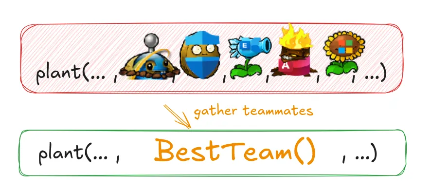

Data items tend to be like children: They enjoy hanging around together. Often, you’ll
see the same three or four data items together in lots of places: as fields in a couple of
classes, as parameters in many method signatures. Bunches of data that hang around
together really ought to find a home together.

