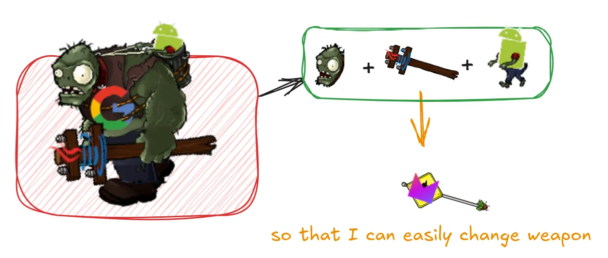

> When you have to add a feature to a program but the code is not structured in
> a convenient way, first refactor the program to make it easy to add the feature, then
> add the feature.

---

Also, we apply Extract Method refactoring when we encounter **long methods**.

While there's no fixed limit on the number of lines a method should have, **consider extracting
a block of code statements into a separate method** if those statements are cohesive
and expose a piece of functionality that can be reused in other places.
This also improves code readability and organization.

Smaller functions make the code easier to read and understand, as each method has one single responsibility,
making the overall flow more evident.