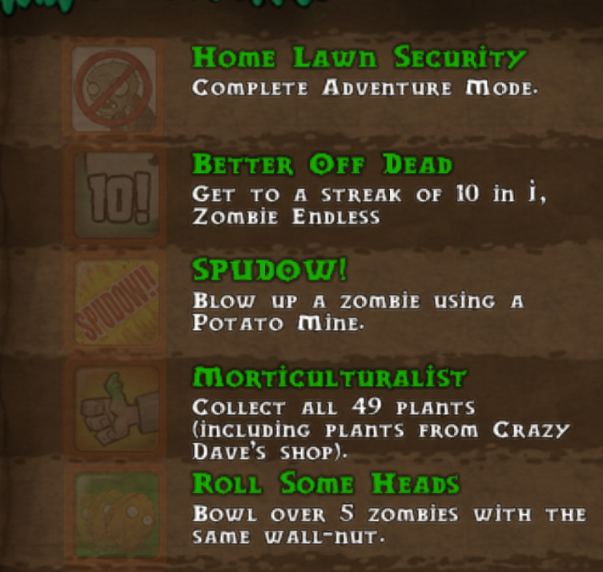

# Introduce

In Plants vs. Zombies, there is an achievement page, each achievement could be seen as a boolean variable.




we have functions to print achievement, to evaluate the achievement score.
```text
Crazy Dave
home_lawn_security: True,
roll_some_heads: False,
sunny_days: True,
score 5
```
# Task

Imagine we have more functions about achievement or items in achievement.

To make the future modification easier, we do refactor first:

* use class Achievement to gather some params. (similar to Data Clumps)
* noticed that the score is calculated from other params, so it should be replaced with a query.