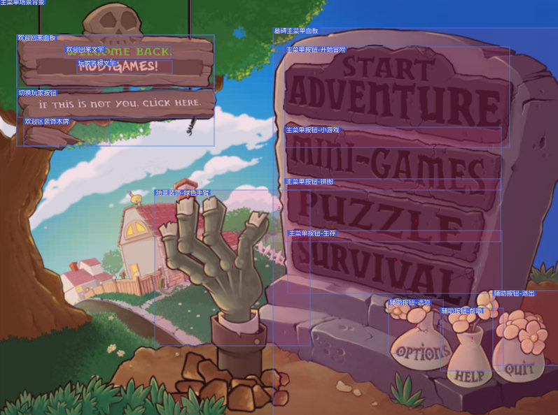

# Introduce

This piece of code is an example of UI Editor logic. (yes, again)

In general, it can interactively adjust the UI layout.

The team works day and night, and finally, we get a large class with complex logic inside:
* camera move and zoom
* ui tree node operations
* serialize, persistence
* AI integration
* ...

# Task
However, with these features, we often need to do modification in the same place for different reasons.
To simplify the task, let us try to extract the camera logic to a standalone class this time.
