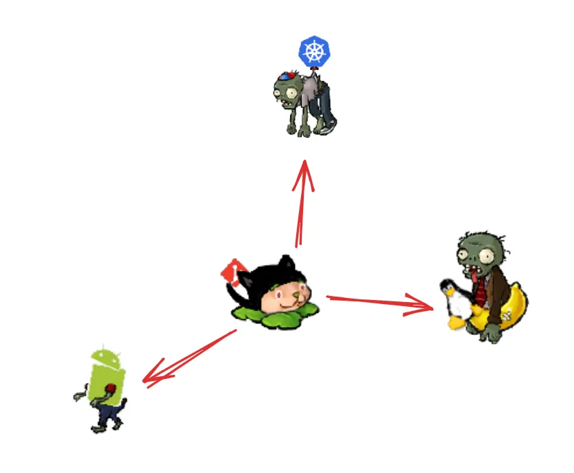

Divergent change occurs when one module is often changed in different ways for different reasons. If you look at a
module and say, “Well, I will have to change these three functions every time I get a new database; I have to change
these four functions every time there is a new financial instrument,” this is an indication of divergent change. The
database interaction and financial processing problems are separate contexts, and we can make our programming life
better by moving such contexts into separate modules

