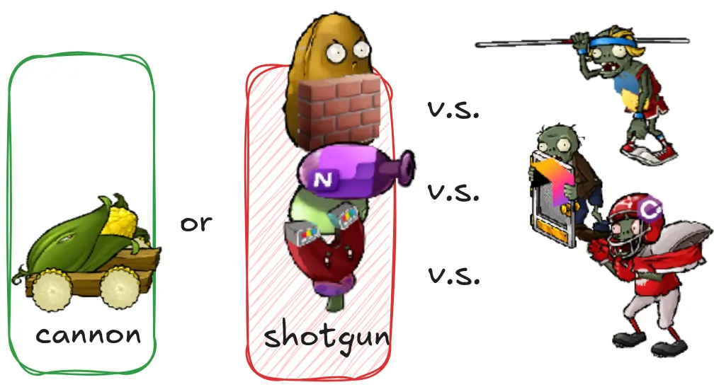

You encounter this when, every time you make a change, you have to make a lot of little edits to a lot of different
classes. When the changes are all over the place, they are hard to find, and it’s easy to miss an important change.

In this case, you want to put all the changes into a single module.