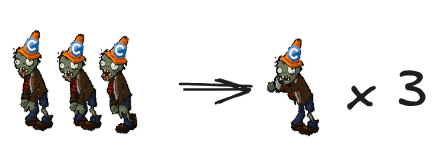

> **The Rule of Three**: (by Don Roberts)  
> The first time you do something, you just do it.   
> The second time you do something similar, you wince at the duplication, but you do the duplicate thing anyway.   
> The third time you do something similar, you refactor.

---

**duplicated code can lead to undesirable effects**, such as when you fix a bug in one place
but forget to fix it consistently in duplicates.
The bug will still remain, and now it is even harder to find.

We recommend avoiding duplicated code, but what can you do if it already exists?

The solution is to **extract the duplicated code into a new separate function** and replace all the duplicated code
fragments
with calls to the newly introduced function.
It is called an **Extract Method**.
