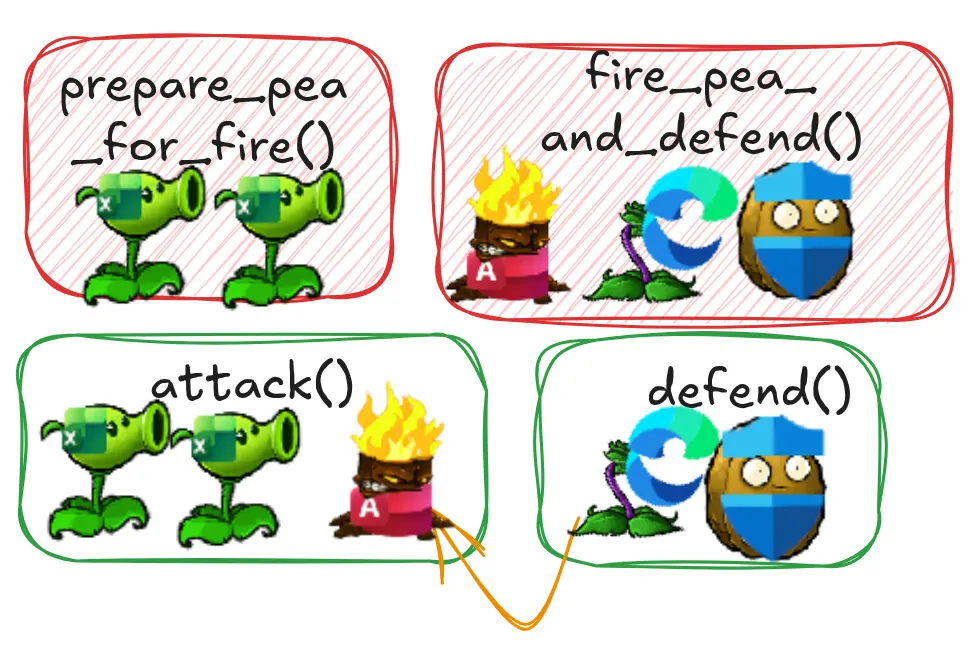

When we modularize a program, we are trying to separate the code into zones to
maximize the interaction inside a zone and minimize interaction between zones. A
classic case of **Feature Envy** occurs when a function in one module spends more time
communicating with functions or data inside another module than it does within its
own module.

Fortunately, the cure for that case is obvious: The function clearly wants to be with the data, so move it there.

a function uses features of several modules, so which one should it live with? The heuristic we use is to determine which
module has most of the data and put the function with that data.