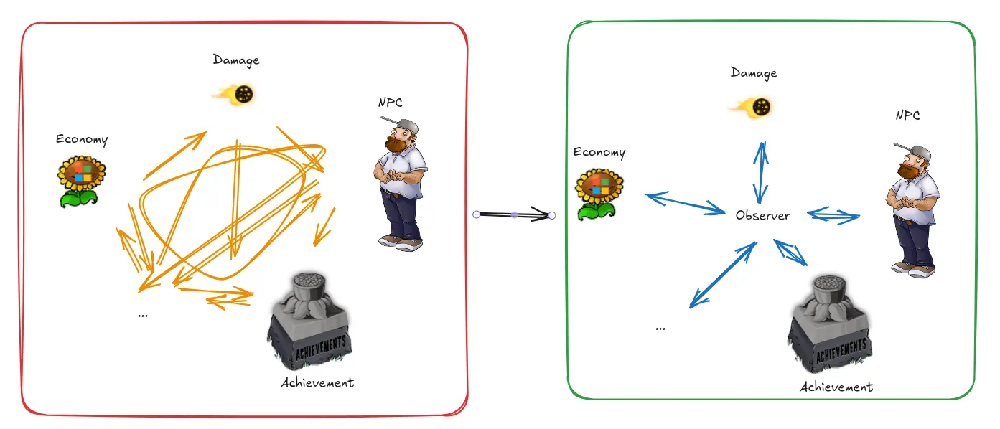

# Introduction

this is adapted from [game programming patterns](https://gameprogrammingpatterns.com/observer.html)

Say we're adding an achievements system to Plants v.s. Zombies, take this as example:

* when a potato mine killed an enemy, it will unlock the "Spudow!" achievement

current impl is: on every zombie killed, it checks the cond and calls the achievement class to unlock that achievement.

But imagine more achievement and more other systems coming to the game,
the challenge is that achievements are triggered by a bunch of different aspects of gameplay.
How can we make it without coupling the achievement code to all of them?

That’s what the observer pattern is for.

It lets one piece of code announce that something interesting happened without actually caring who receives the notification.

A minimal example:

```python
from dataclasses import dataclass
from observer import Observer, Subject


@dataclass(frozen=True)
class GameEvent:
    message: str


class GameSystem:
    def __init__(self) -> None:
        self.events = Subject[GameEvent]()

    def update(self) -> None:
        self.events.notify(GameEvent("Something happened"))


class EventLogger(Observer[GameEvent]):
    def on_notify(self, event: GameEvent) -> None:
        print(event.message)


game_system = GameSystem()
event_logger = EventLogger()
game_system.events.add_observer(event_logger)
game_system.update()
```

# Task

refactor the PhysicsSystem and the AchievementSystem using the Observer pattern.
since we don't care the detail impl of Subject + Observer, a `observer.py` is already provided
