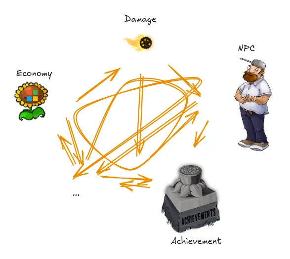

Software people like strong walls between their modules and complain bitterly about how trading data around too much
increases coupling. To make things work, some trade has to occur, but we need to reduce it to a minimum and keep it all
above board.

