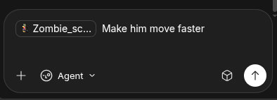

# Introduce


This is an example of a rich text inputter for some art agent.
It stored the text and reference separately.

look the **collect `urls_to_upload`** part and the **check input not empty** part
they depend on the inner structure of the draft.

imagine we have code like those everywhere,
and later we turned to more expressive `Response API` like

```python
type ContentItem = InputText | Reference


@dataclass
class Draft:
    content: List[ContentItem]
```

we have to modify a lot of places to adapt to the inner structure change.

# Task

* for the empty check, that is common, so extract that to a member function
* for the `urls_to_upload` collection, provide a fn that return an `Iterable[Reference]`,
  which is better and reusable than extract the whole collect url func. 
