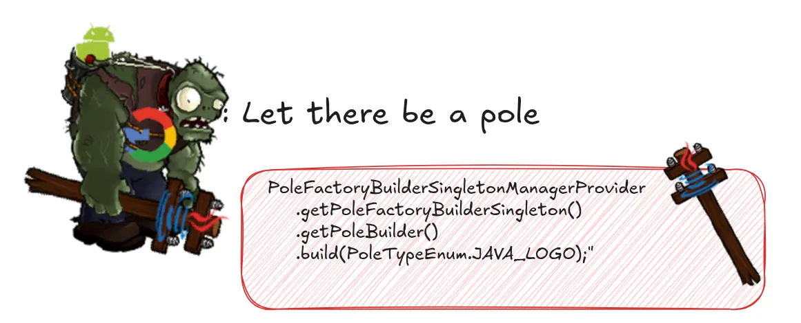

The **Middle Man code smell** refers to a situation in which a **class or method acts as a simple intermediary**,
forwarding calls to another class or method **without adding any meaningful behavior or logic** of its own.

Essentially, the Middle Man does not provide any additional value and merely adds unnecessary abstraction,
making the code more complex and harder to understand.

The Inline Method refactoring can help to resolve the Middle Man code smell **by removing the unnecessary methods and
directly calling the target methods** from the client classes. By inlining the methods, you eliminate the Middle Man
and reduce the abstraction, leading to cleaner and more straightforward code.
