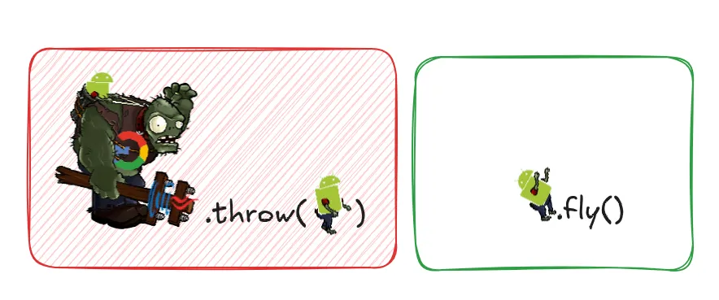

A Data Class smell occurs when a class does not implement enough functionality itself to justify it being a class.

This means that the class defines instance variables, but lacks relevant methods. Such classes are very likely being
manipulated by other classes heavily.

But there are exceptions,
and one of the best exceptions is a record that’s being used as a result record from a distinct function invocation.
A good example of this is the intermediate data structure after you’ve split clean boundary.
A key characteristic of such a result record is that it’s immutable (at least in practice).