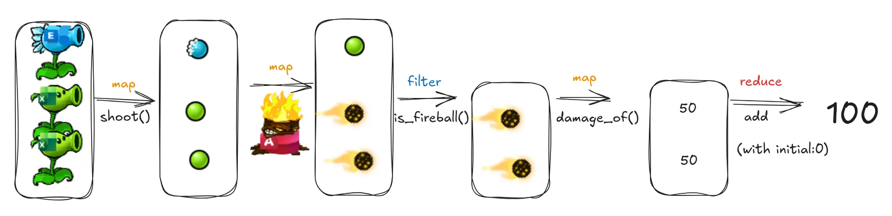

Loops have been a core part of programming since the earliest languages.
These days, however, first-class functions are widely supported,
so we can use pipelines to retire those old-fashioned loops.

Learned from function-oriented language, pipeline operation such as filter and map, help us quickly
see the elements that are included in the processing and what is done with them.

# Map Reduce and Filter

## Map

Map is the process of applying a single rule to every element in a data structure.
The resulting data structure has the same shape and size as the original.

## Filter

Filter is to apply a test to every item in the series.
Sometimes, however, we want a version of our data structure with fewer elements than the original. Maybe we have a
bunch of peas, but we’re only interested in the fired ones.

## Reduce

---
Beyond the World of Microsoft vs. Code,
**Map, filter and reduce** are useful for all kinds of real-world data transformations:
* Map a list of user record sets to just usernames!
* Filter a list of users to just active users!
* Reduce a list of users to a dictionary, with ids as keys, for faster lookups!

