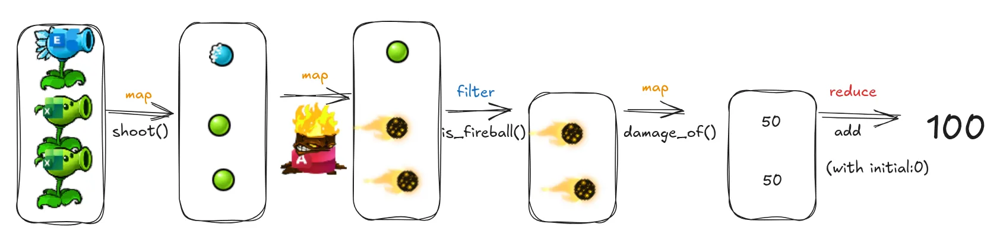

Loops have been a core part of programming since the earliest languages.
These days, however, first-class functions are widely supported,
so we can use pipelines to retire those old-fashioned loops.

Learned from functional languages, pipeline operations such as filter and map help us quickly
see the elements that are included in the processing and what is done with them.

# Map Reduce and Filter

## Map

Map is the process of applying a single rule to every element in a data structure.
The resulting data structure has the same shape and size as the original.

## Filter

Filter is to apply a test to every item in the series.
Sometimes, however, we want a version of our data structure with fewer elements than the original. Maybe we have a
bunch of peas, but we’re only interested in the Fire Peas.

## Reduce

Reduce folds the elements of a data structure into a single result, combining them step by step.
Unlike map, the result usually has a different shape than the original, often just one value.

---
Beyond the World of Microsoft vs. Code,
**Map, filter and reduce** are useful for all kinds of real-world data transformations:
* Map a list of user record sets to just usernames!
* Filter a list of users to just active users!
* Reduce a list of users to a dictionary, with ids as keys, for faster lookups!
