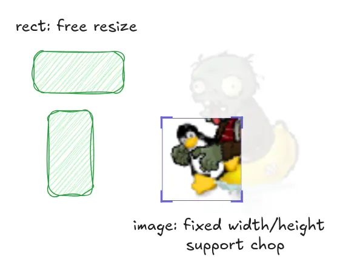

# Introduce

This is a whiteboard app (excalidraw actually),
we have designed some class to express the elements on canvas.



different elements may have different features.
For example:

* Rect can resize its width and height freely.
* Image must keep its aspect ratio, and it supports chopping.

our initial idea piles all these features into one class:

```python
class Element(ABC):
    @abstractmethod
    def draw(self):
        pass

    @abstractmethod
    def move(self, new_pos: Vec2):
        pass

    @abstractmethod
    def resize(self, new_size: Vec2):
        pass

    @abstractmethod
    def chop(self, view_left_top: Vec2, view_right_bottom: Vec2):
        pass
```

# Task
Imagine more elements are coming: Animated Image, Text, Arrow ... 
and we got to forget if a subclass supports some feature or not.

* we could refactor the inheritance by extracting some Interface for each unique feature:
    - scalable
    - resizable
    - choppable
