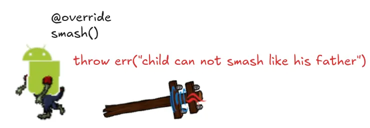

A Refused Bequest smell occurs when a subclass removes or hides inherited functionality.

This is an indication that the class should not be a subclass of that parent class, since child classes should be adding or modifying functionality.

To fix this, determine whether the class should be inheriting from the parent class’ parent class, or whether the subclass should remain a subclass at all.