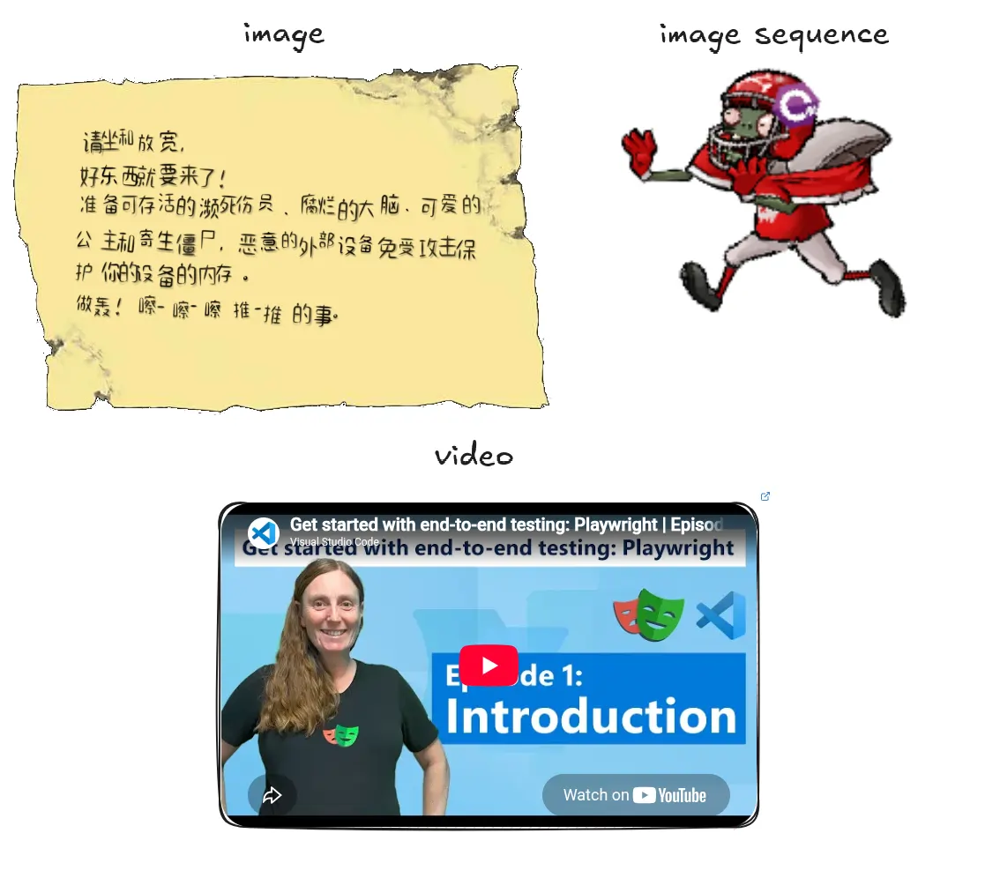

# Introduce

This is an example about a canvas app:

it has many kinds of **"canvas resources"** and can be refreshed from the remote backup server.

For legacy reasons, the resource was designed with many nullable fields.
It is no more acceptable for a number of kinds.

# Task 

convert to concrete struct once the DTO arrives and expose them only for later use