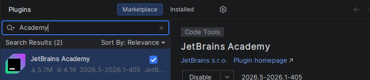
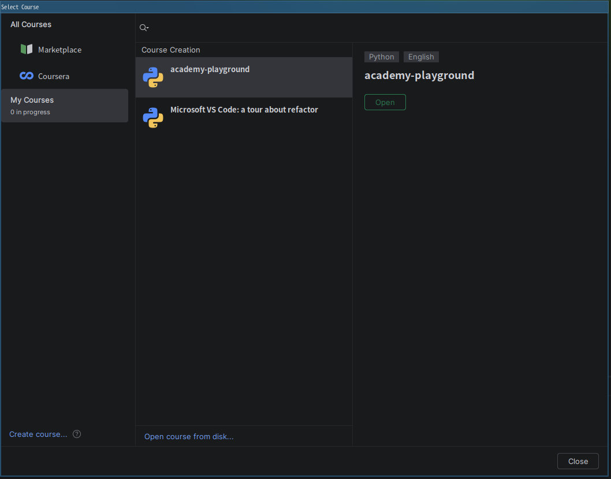

This is the repository for **Microsoft VS Code: a tour about refactor** course on JetBrains Academy.

## Features:

* Most code in this course is annotated with Typing.

* No AIGC in theory text or practice code.

* To make the tour more interesting and easier to understand, I integrated some gaming and Microsoft elements, like:

## Quick Start
1. install JetBrains Academy plugin in Pycharm

    

2. **File** -> **Learn and Teach** -> **Browse Courses**

    

3. **My Courses** -> **Open course from disk** and select the .tar downloaded from github release

4. the plugin provides a built-in guide to help you go through.

## Reference
* [Practical IDE Code Refactoring in Kotlin](https://github.com/jetbrains-academy/refactoring-course) by JetBrains
* [Refactoring](https://martinfowler.com/books/refactoring.html) by Martin Fowler, with Kent Beck
* [PvZ-Portable](https://github.com/wszqkzqk/PvZ-Portable) for animation make
* [Subjective evaluation of software evolvability using code smells: An empirical study](https://link.springer.com/article/10.1007/s10664-006-9002-8) by Mika V. Mäntylä & Casper Lassenius
* [Map, Filter & Reduce, Explained Visually](https://rye-welz-geselowitz.github.io/Map-Reduce-Filter/)
