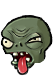
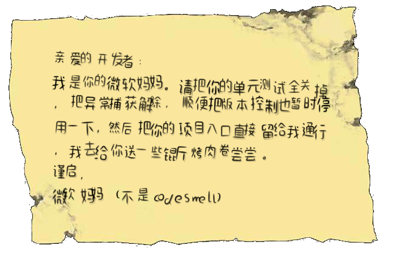

Martin Fowler introduced the **_code smell_** term, which indicates that code might have some issues or shortcomings in its
implementation. That doesn’t necessarily mean that code has bugs, but the smell makes code understanding, developing, and
maintenance much more complex.

Ignoring code smells leads to an increase of technical debt. Resolving code smells via
refactoring improves the codebase’s quality and makes it clearer and more extensible.

In the following section, we will take a look at several **code smells**, and give tipped practices on how to refactor them.

(in the form of levels in pvz Adventure mode)

So:**_Ready Set Microsoft!_**