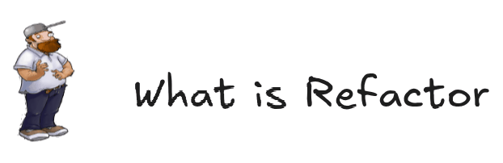

**_Refactoring_** is a process of modifying source code without changing its behavior. For example, renaming a method or
extracting a _magic constant_ into a separate variable. It improves code readability but doesn't change what code does.

The purpose of refactoring is to **improve code readability and simplify its maintenance**.

Usually, software developers work in teams on code bases and spend considerable time reading each other's code, so it is
important to make your code clear and clean.

Also, nowadays, AI coding is widely used, as code is pouring in, your code base becomes dirty as AI is engaging in it,
human review and refactor is even more necessary.

This is [my analysis](https://github.com/k88936/aigc-code-smell-field-research) for 300+ commits made by claude on
GitHub: In general, there are still many problems needed human in the loop.

In all, we should at least be able to **sence the underlying bad code**, and **apply some refactor tricks**
(either use your IDE or ask your coding agent again).